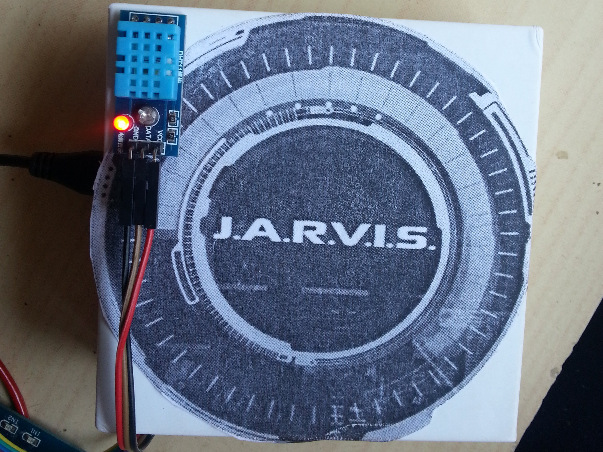
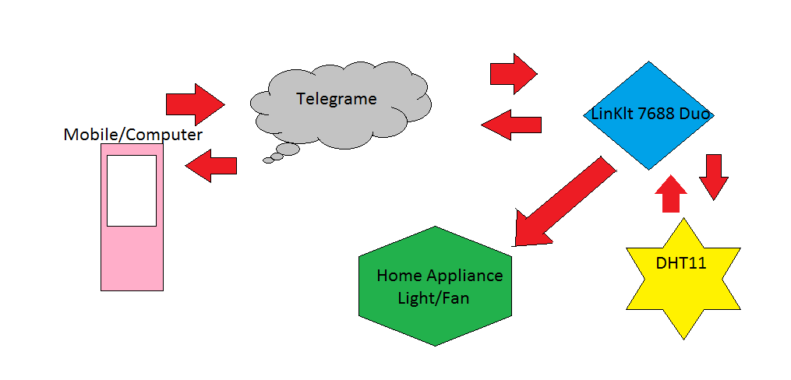

Originally Published at Hackster.io -  [Jarvis - Personal Assistant](https://www.hackster.io/Salmanfarisvp/jarvis-personal-assistant-ef7392)

## Introduction
Have you ever said, "I wish I had a personal assistant"? Yeah, everyone needs a personal assistant to do things. Now here I am introducing a personal assistant based on Linklt Smart 7688 Duo and Telegram. It has both the powers of Linux and Arduino.

## JARVIS
Yeah, it's a personal assistant based on Linklt Smart 7688 Duo and Telegram Bot. We can directly chat to our Jarvis Bot for getting information like temperature and humidity in your house or to read the latest news from BBC or whatever your preference. You can also control home appliances via chatting with your bot.

## Demo

<iframe width="560" height="315" src="https://www.youtube.com/embed/ZqbgN57VF70?si=rI1xnR26eJxwWgyD" title="YouTube video player" frameborder="0" allow="accelerometer; autoplay; clipboard-write; encrypted-media; gyroscope; picture-in-picture; web-share" referrerpolicy="strict-origin-when-cross-origin" allowfullscreen></iframe>

## Parts

<iframe width="560" height="315" src="https://www.youtube.com/embed/_KO2w48N4RE?si=YC6Tc1Hio3scqrhJ" title="YouTube video player" frameborder="0" allow="accelerometer; autoplay; clipboard-write; encrypted-media; gyroscope; picture-in-picture; web-share" referrerpolicy="strict-origin-when-cross-origin" allowfullscreen></iframe>

## Flow diagram

### Network Connectivity

When building this solution, we're assuming connectivity to the internet is available. This can be through a home WiFi network, or a cellular phone can be used to tether the devices to the internet. So we need to setup the WiFi first.

### Power Supply

For Linklt, we only need 5v, so we can use a power bank. The relay connection needs 240v AC, so we can only control 240V AC via 5v relay.

You can find the fully instruction here at [Jarvis - Personal Assistant](https://www.hackster.io/Salmanfarisvp/jarvis-personal-assistant-ef7392)

