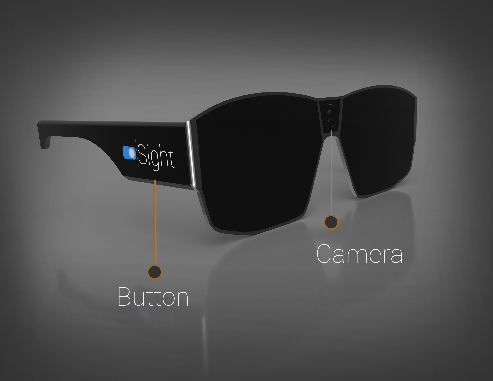
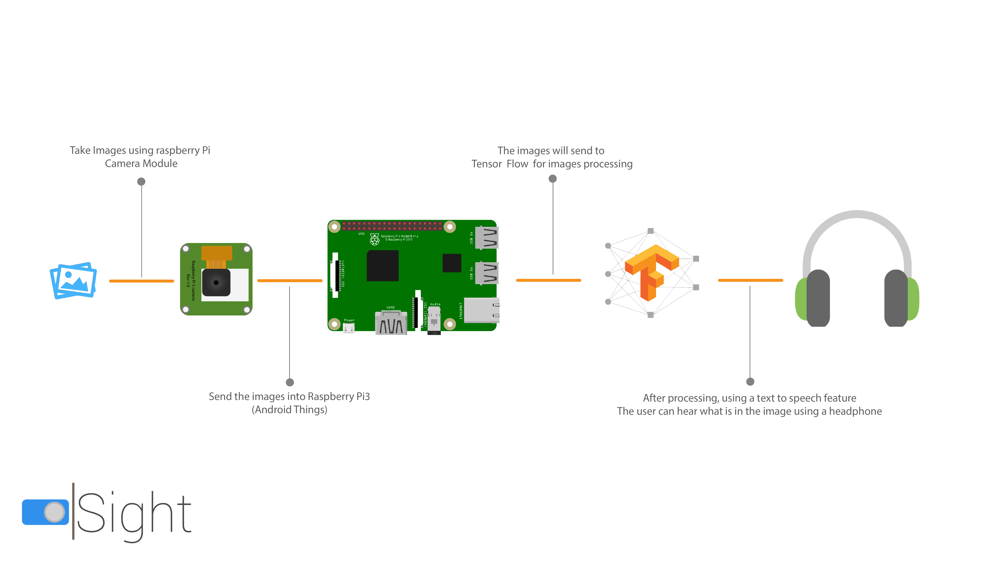

Originally published at hackster.io - [SIGHT: For the Blind](https://www.hackster.io/makergram/sight-for-the-blind-c1e1b9)

Ever thought how is the life of a blind person, their life is full of risk. They can't even walk alone through a busy street or through a park. They shall need some assistance from others. They are also curious about the beauty of the world, they should have will be the excitement to explore the world, and to be aware of what is happening in front of them. Even though they can find their own things without anyone's need. So,How we solve this?

We are introducing Sight!

<iframe width="560" height="315" src="https://www.youtube.com/embed/du8LyRrKU0k?si=e_o7dgW1DOpkIJRG" title="YouTube video player" frameborder="0" allow="accelerometer; autoplay; clipboard-write; encrypted-media; gyroscope; picture-in-picture; web-share" referrerpolicy="strict-origin-when-cross-origin" allowfullscreen></iframe>

Simply, Sight is a pair of smart glasses for the blind. By using Sight, a person can able to know what is going on in front of him.

### How Sight Works

Sight is developed with a raspberry pi 3 and Google android things.

Sight does have three main parts, a raspberry pi 3 (powered by android things), camera and a button. When the person press the button on the Sight, The Sight will take a picture and analyze the image using tensor flow and detect what is that picture is about, then using a speaker or headphone, the Sight will voice assist the person about that picture.

You can find more details here at [SIGHT: For the Blind, Hackster.io](https://www.hackster.io/makergram/sight-for-the-blind-c1e1b9)

