In this blog we are going to learn to host web pages on GitHub for free using GitHub Pages!🤩 .  we will host very simple web page like [https://0xsalfar.github.io](https://0xsalfar.github.io) from scratch to complex one.

[](https://youtu.be/w3jLJU7DT5E)

So what is GitHub ? GitHub is company that provide software development version control using Git! So what is Git? Git is a distributed version-control system for tracking changes in source code during software development. it's very convenient for large software companies and or many developers working in a same project. There are many version control service like GitHub example GitLab,Bitbucket ..etc and we can also host our own verison in our server too.

[](https://youtu.be/2MsN8gpT6jY)

Here we are using  GitHub pages service, it's static site hosting service that takes HTML, CSS, and JavaScript files straight from a repository on GitHub, optionally runs the files through a build process, and publishes a website.

we can use the github.io sub domain or we can also use cutom domain , here we just using the default github.io sub domain for simplicity . we can start  setup by ste

## Step 1: Create GitHub account

First we need a GitHub account , that's very simple and straightforward, you need to go to github.com  and fill your personal information like Email id , Username and  Password for the Github profile then click Sign up for GitHub, if  you already have an account you can login to that and skip the Step 1.


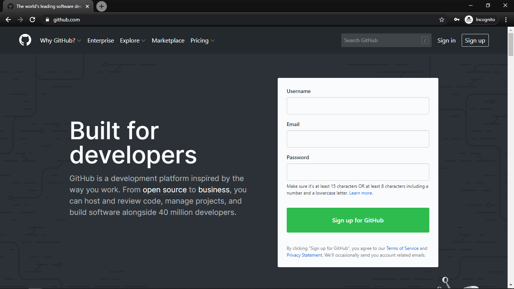
_GitHub Create Account Page_

next you might need some human verification to avoid bot's and programs to create the GitHub account , that's also very simple like my challenge was to align a turtle 😅.

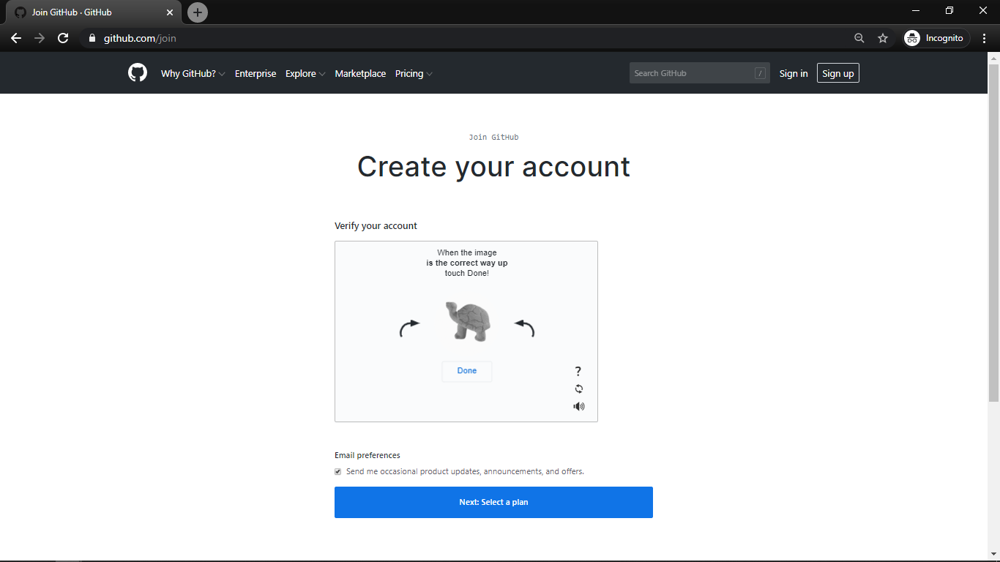
_GitHub Human Verification_

next we need to select a plan. GitHub two basic plans , one is free that does';t have any private repo that can collaborate more than one  and another plan is Pro that actually  for team who need private repo and also many features.


_GitHub Plan's_

As individual we just need to Free plan, so select that and following that we need to enter some information.

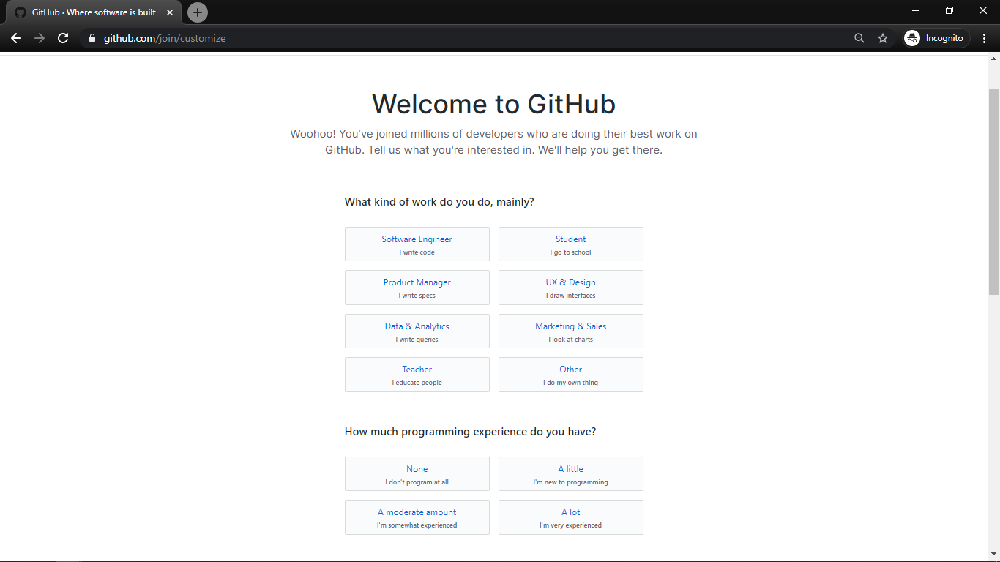

You can select depends what applies to you and click Complete Setup.

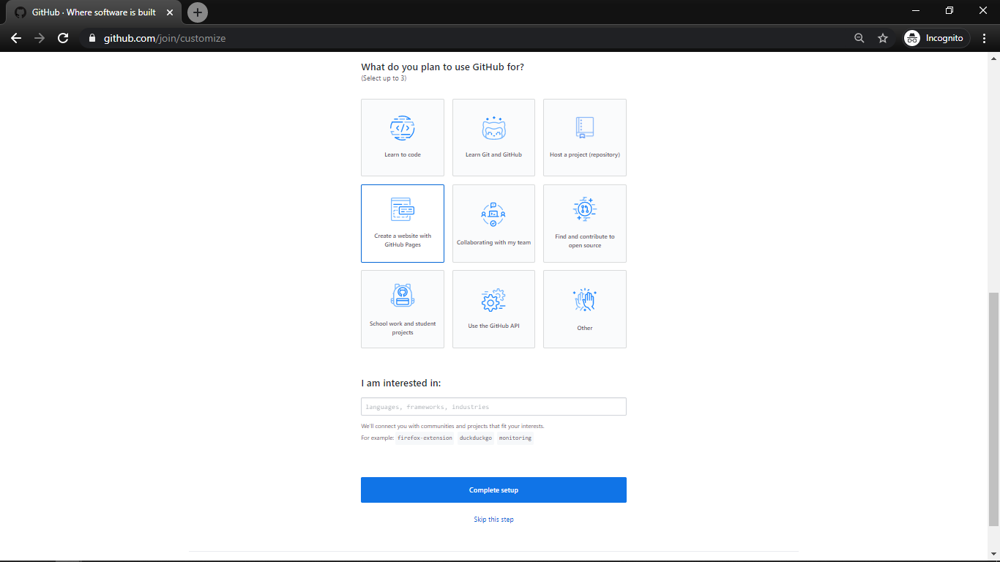

Next we need to verify our mail id in order to get start to use GitHub.  for that check your given mail id and confirm the mail by clicking verify email address button .

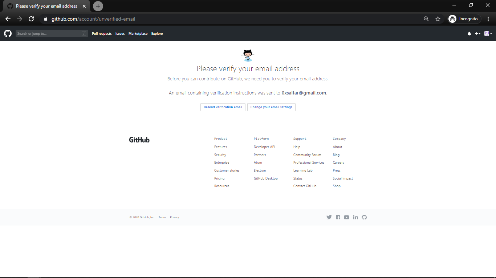

## Step 2: Start a new Project.


next we need to start a new project , it can done by clicking the start a project button.

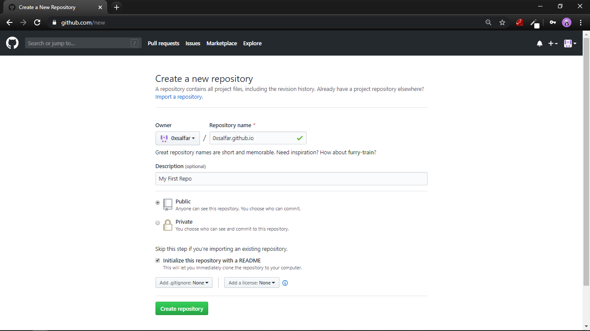

next gave name to project , since we are building the GitHub Page website use username.github.io . then add description then select the Public radio button and finally select Initialize this repository with a README , it will create README.md file then click Create repository to start.

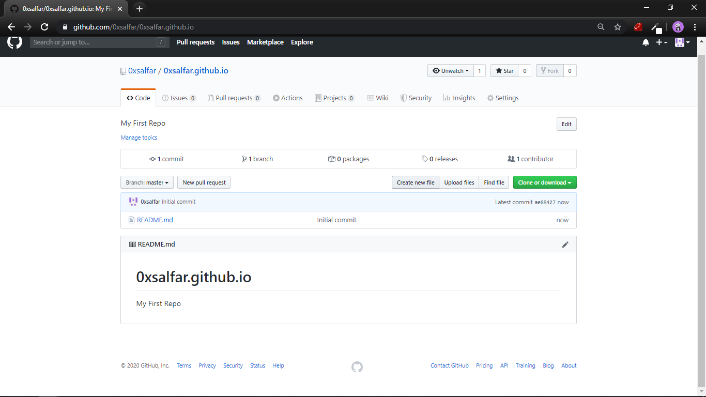

now we can see a window like this, that mean we created our first GitHub project 🎉.

## Step 3: Create HTML File.

Click  Create new file and put index.html as name and add some basic html codes.

```
<html>
  <body>
    <h1> Hello World </h1>
    <p>Thi is webiste is hosted in github using github pages and html </p>
  </body
<html>
```

next add some commit messages and click Commit new file.

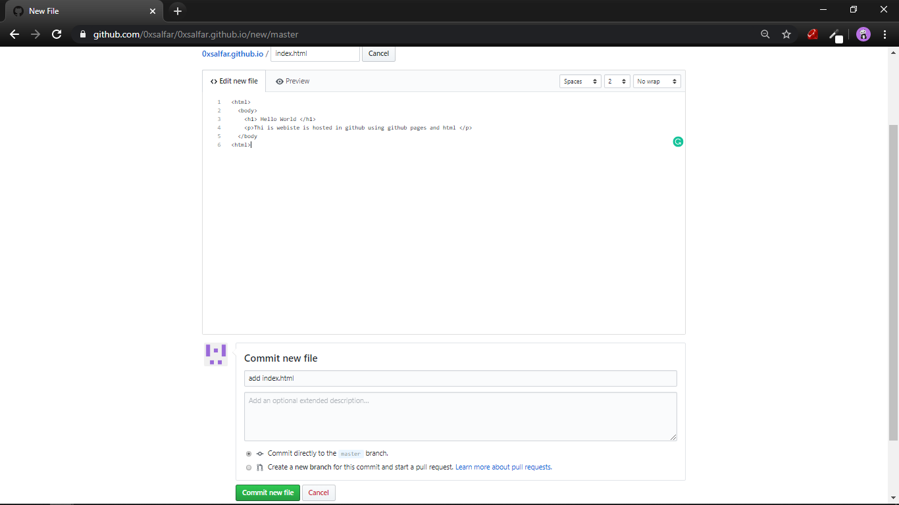

next you can see the index.html file on the listed file.

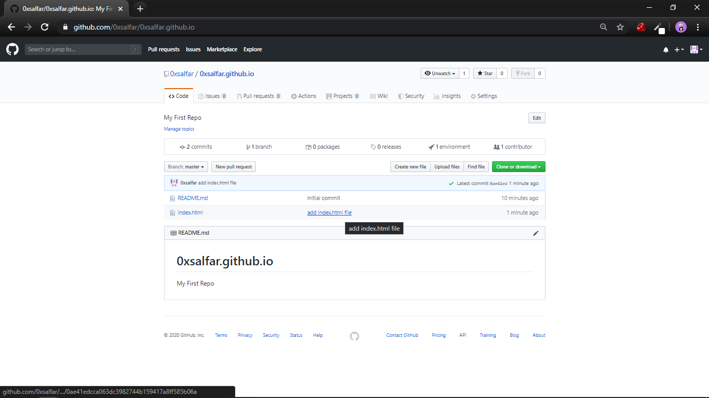

## Step 4: Initialize GitHub Pages.

Next we need to Initialize GitHub Pages for that, we need to go to settings -> GitHub Pages

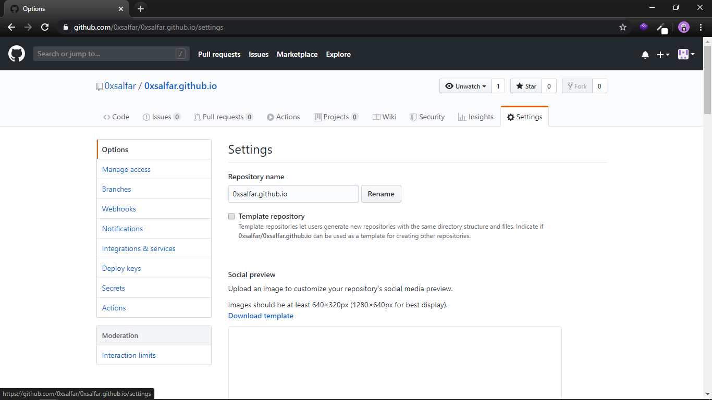

here you can see the GitHub page is automatically enabled , that because we used the GitHub page naming conversion to name the project.


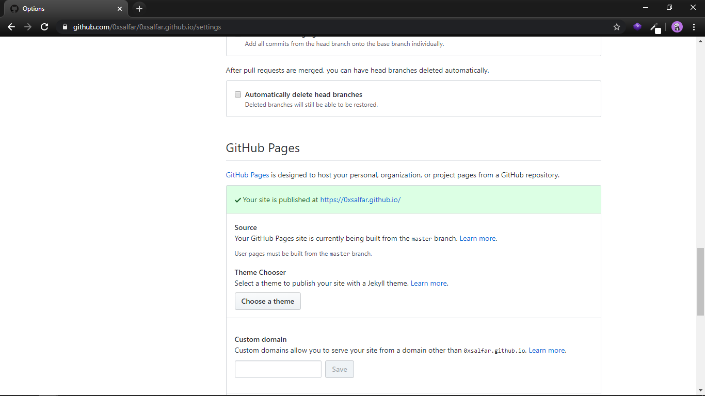

if you are not using the username.github.io you need specify the branch to be used for GitHub pages like in the below.

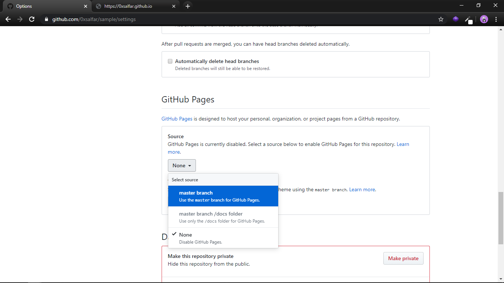

select the master branch and wait until the page automatically refresh and you'ill get a URL like username.github.io/repoName mine is https://0xsalfar.github.io/sample/

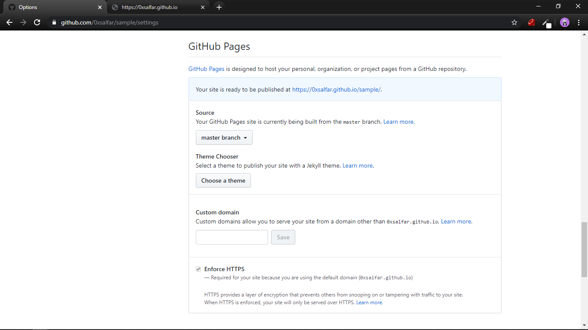

## Step 5: Browse GitHub Page.

Click the URL and you can browse your web page, you just hosted your own website cool 😎.

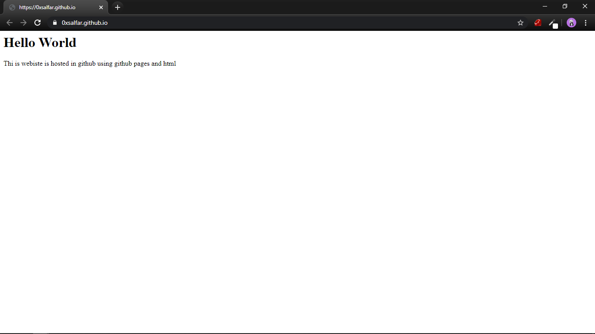

## ToDo:

* Use any free webiste template and customze your website.
* Use Custom domain like www.example.com instead to github.io sub-domain.
* Try using markdown instead of HTML
* Try using Jekyll or other statsic website genarator.

Part 2 will update soon with the ToDo. 😋 You can add your questions and feedback on our [MakerGram community forum](https://community.makergram.com/topic/128/part-1-host-a-website-on-github-for-free-using-github-pages-1-2) .

Originally published at [https://makergram.com/blog/part1-host-website-on-github-for-free/](https://makergram.com/blog/part1-host-website-on-github-for-free/) .


