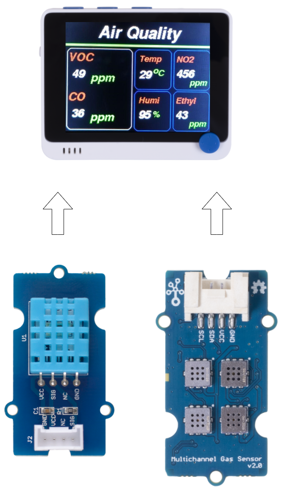

# Story

TL;DR: The Air Quality Terminal can be used as an indoor air quality meter to monitor Volatile organic compounds(VOCs), Carbon monoxide(CO), Nitrogen Dioxide(NO2), Ethyl alcohol(C2H5CH), Room Temperature and Humidity which can be used detect gas leaks and make alert..etc.

# Introduction

Breathing quality indoor air is critical for good health, Humans spend a significant amount of time indoors—either in the home, office or other types of buildings—where gases, chemicals and other pollutants can cause headaches, eye irritation, allergies and fatigue. Serious pollutants can cause certain types of cancers and other long-term health complications. (Src: https://pureaircontrols.com/why-indoor-air-quality-is-important-to-all-of-us/)

The Air Quality Terminal can be used as an indoor air quality meter to monitor **Volatile organic compounds(VOCs)**, **Carbon monoxide(CO)** , **Nitrogen Dioxide(NO2)**, **Ethyl alcohol(C2H5CH)**, **Room Temperature** and **Humidity** which can be used detect gas leaks and make alert..etc.

**Carbon monoxide** is a colourless and odourless gas which is not easily detectable by human senses and interferes with oxygen delivery throughout the body. Carbon monoxide causes headaches, dizziness, weakness, and nausea. Toxic amounts can lead to death.

**Nitrogen dioxide**, which is also a colourless and odourless gas, causes eye, nose and throat irritation, shortness of breath, and an increased risk for respiratory infections.

**Volatile organic compounds (VOCs)** - VOCs are organic chemicals that have a high vapour pressure at ordinary room temperature. Their high vapour pressure results from a low boiling point, which causes large numbers of molecules to evaporate or sublimate from the liquid or solid form of the compound and enter the surrounding air, a trait known as volatility. For example, formaldehyde, which evaporates from paint and releases from materials like resin, has a boiling point of only –19 °C (–2 °F).

**Ethyl Alcohol**- Ethanol, also called alcohol, ethyl alcohol and grain alcohol, is a clear, colourless liquid and the principle ingredient in alcoholic beverages like beer, wine or brandy. Because it can readily dissolve in water and other organic compounds, ethanol also is an ingredient in a range of products, from personal care and beauty products to paints and varnishes to fuel.

Here I will show you how to build the Air Quality Terminal step by step 🙂. You can find steps and explanation here at [Air Quality Monitoring Station with Wio Terminal](https://www.hackster.io/Salmanfarisvp/air-quality-monitoring-station-with-wio-terminal-6ef85f) by Salman Faris.

