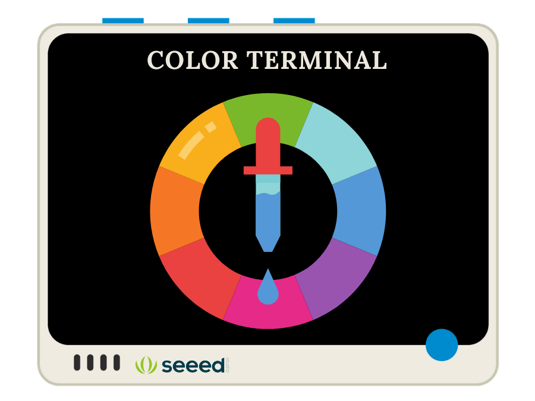
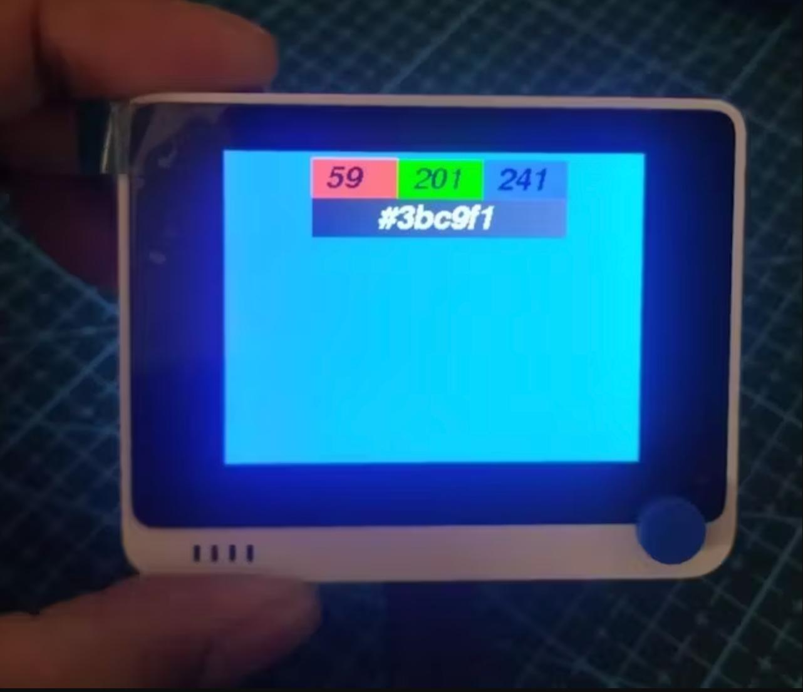
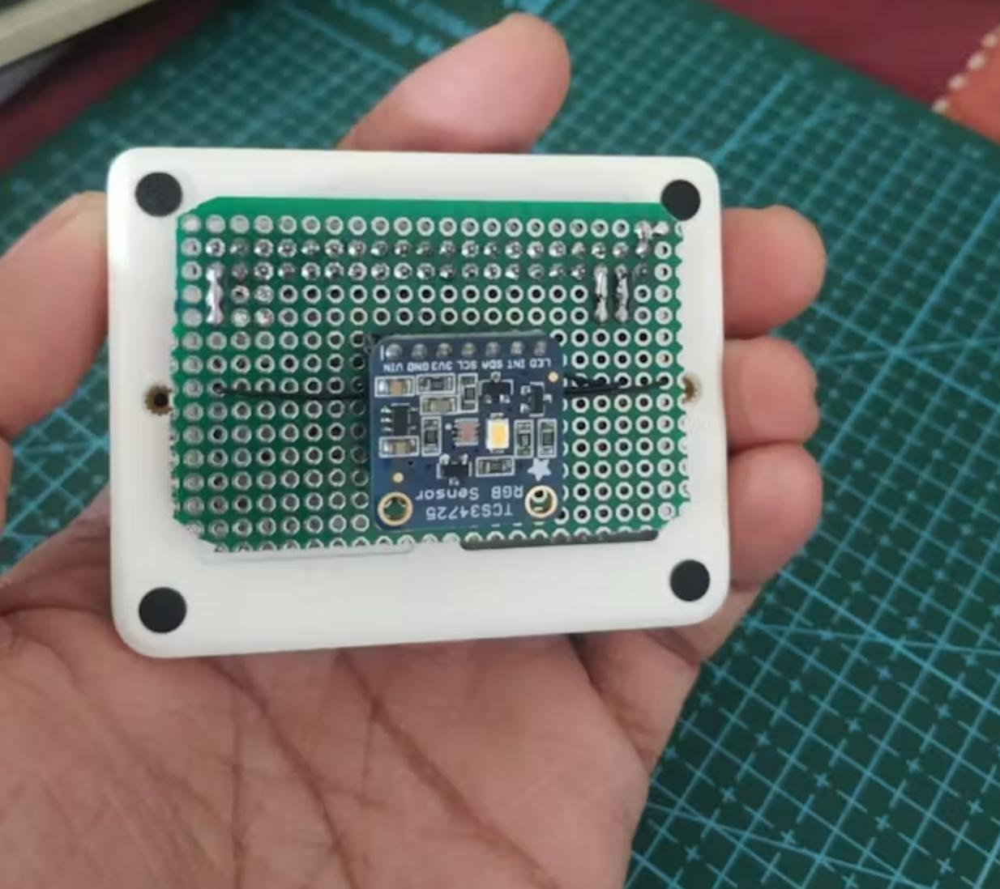

Originally Published on [Hackster.io/Salmanfarisvp](https://www.hackster.io/Salmanfarisvp/color-terminal-7d6650)

TL;DR -The Color Terminal can be used to pick color from physical things by scanning its surface with Seeed Wio Terminal and TCS34725.

A color picker (also color chooser or color tool) is a graphical user interface widget, usually found within graphics software or online, used to select colors and sometimes to create color schemes. ([WiKi](https://en.wikipedia.org/wiki/Color_picker))

### Video Demo
<iframe width="560" height="315" src="https://www.youtube.com/embed/4GgjbHjRpiM?si=G4bQWjnUOvtLkvAS" title="YouTube video player" frameborder="0" allow="accelerometer; autoplay; clipboard-write; encrypted-media; gyroscope; picture-in-picture; web-share" referrerpolicy="strict-origin-when-cross-origin" allowfullscreen></iframe>

Traditional color picking software can't take color from a physical surface, that's where the color terminal comes to play. It's a device that can take color and provide color code in Hex and RGB values.

Back Side.

The Color terminal powered by SeeedStudio [Wio Terminal](https://www.seeedstudio.com/Wio-Terminal-p-4509.html) and Adafruit [RGB Color sensor](https://www.adafruit.com/product/1334).

Read full instruction on how to build your own here. [Color Terminal 🎨 by Salman Faris](https://www.hackster.io/Salmanfarisvp/color-terminal-7d6650)

