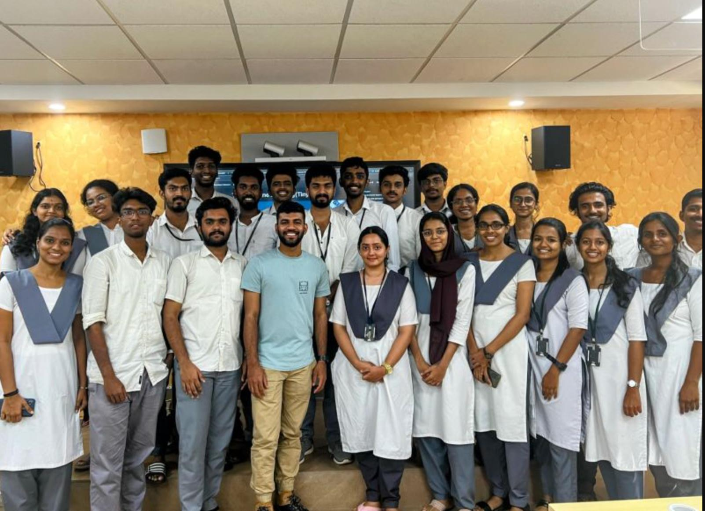
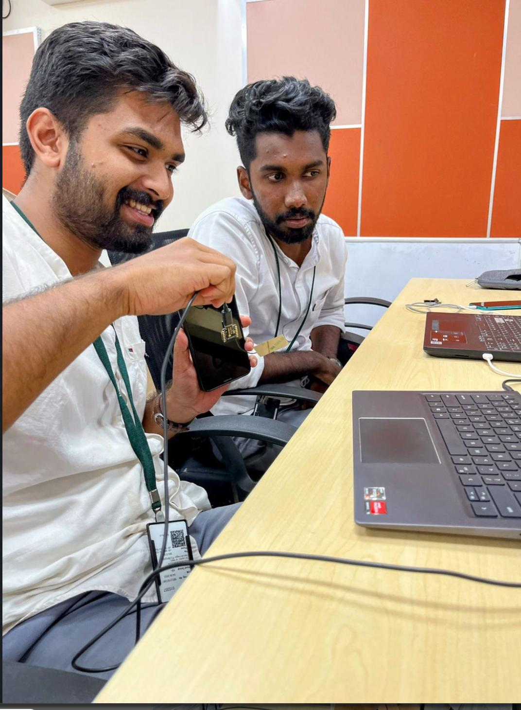
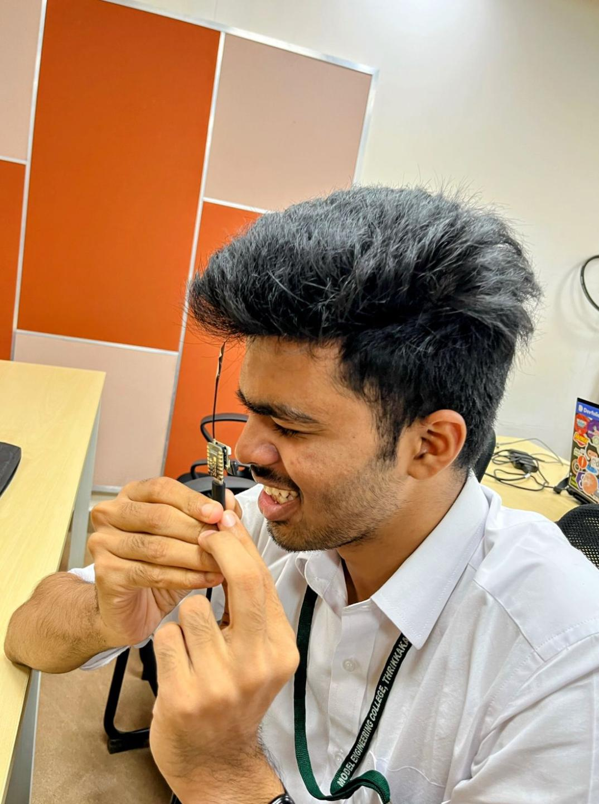
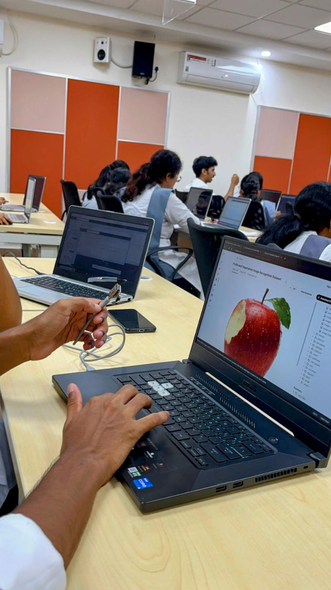

Originally posted in [Linkedin](https://www.linkedin.com/posts/salmanfarisvp_tinymlabrworkshopabrseries-tinyml-tinyml-activity-7101160669881802752-fpuO?utm_source=share&utm_medium=member_desktop)

Seeed Studio #TinyML_Workshop_Series 🚀

We successfully completed 3rd hashtag#tinyML hands-on workshop at Model Engineering College kochi with the support Seeed Studio. It was a intensive session focusing on hands-on workshop applying on real world situations .

At the end of the session, participants made their fully functional hashtag#TinyML project using Seeed Studio hashtag#XIAO and Edge Impulse , the project includeds controlling lights using eyes 👀, Fruit 🍎 🍌classification , Car 🚗 and Bike 🏍️, Potholes 🛣️🚧 identification , wild animal 🐘 classification using sound..etc.

Thanks to Seeed Studio and their awesome team, Cognicor-AICTE IdeaLab for the invitation, MakerGram and MUHAMMAD SWALAH for the
support.

If you want to conduct online and offline tinyML sessions, DM me and let’s discuss 🤗.
