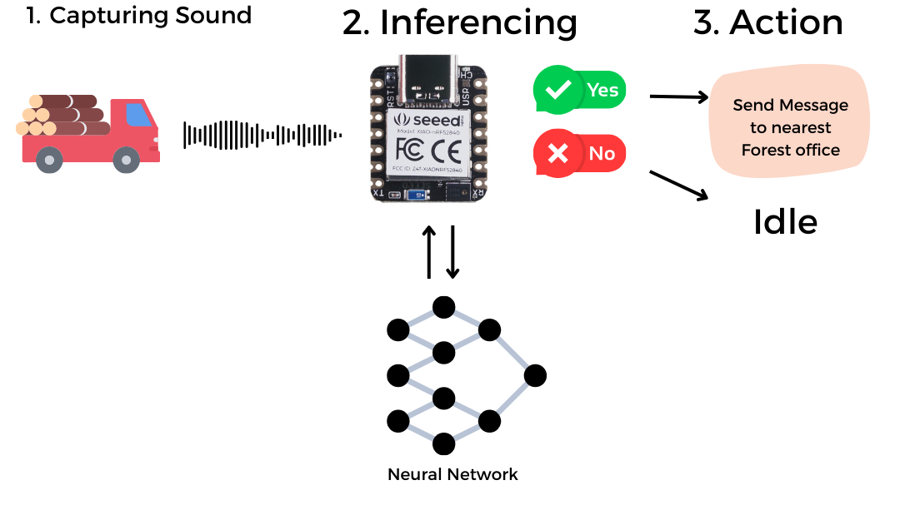
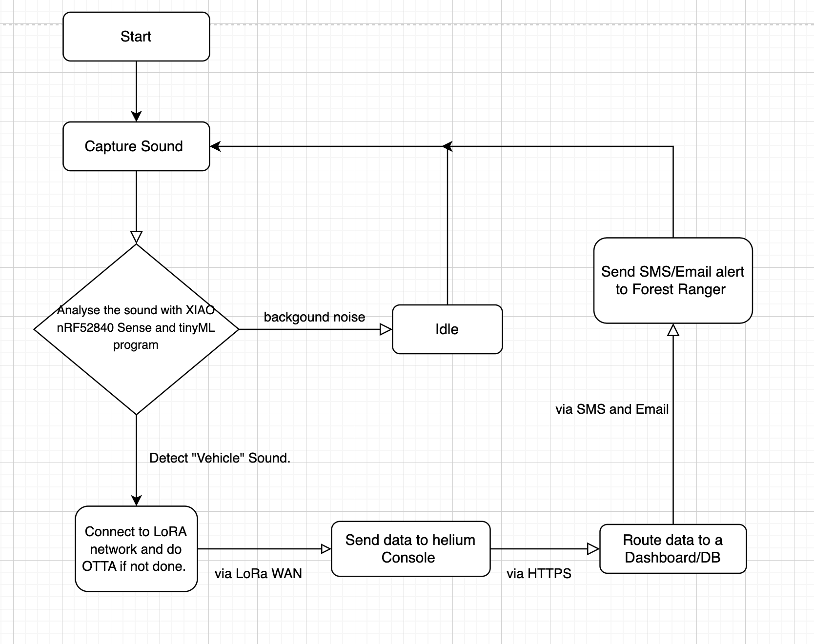
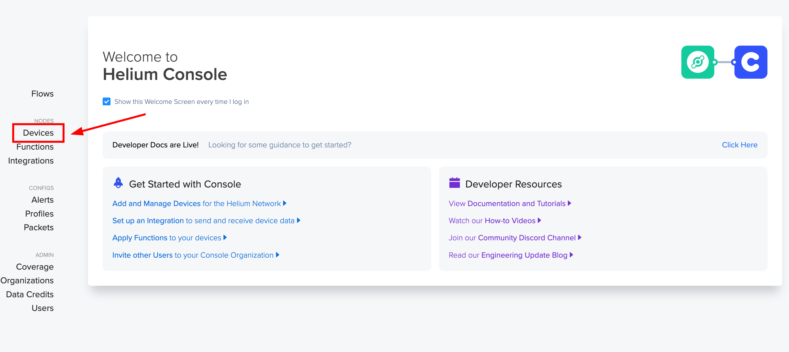
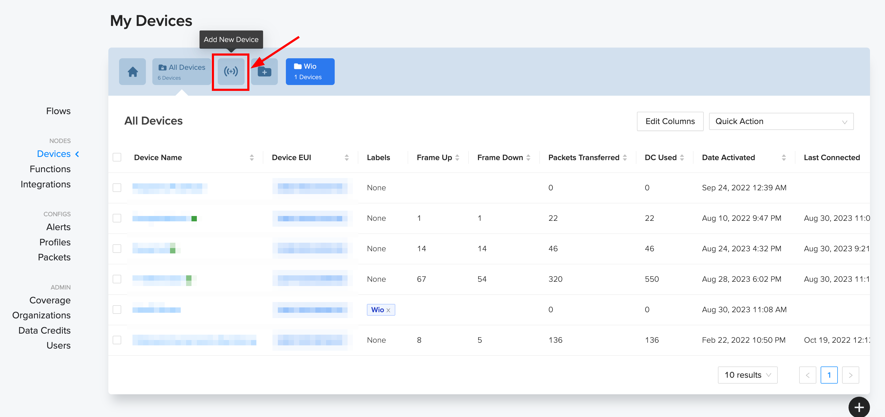
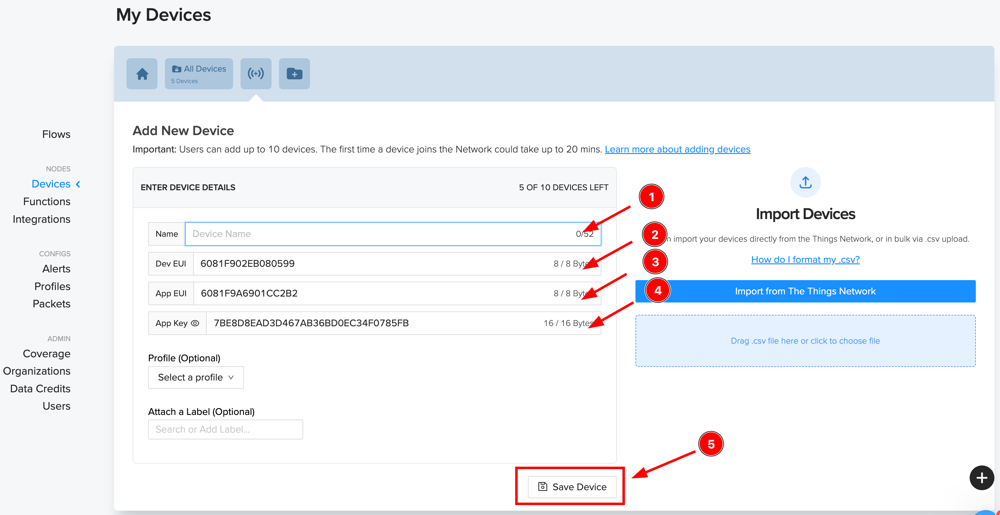
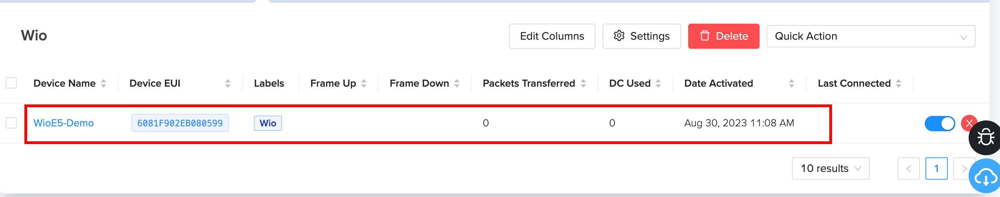
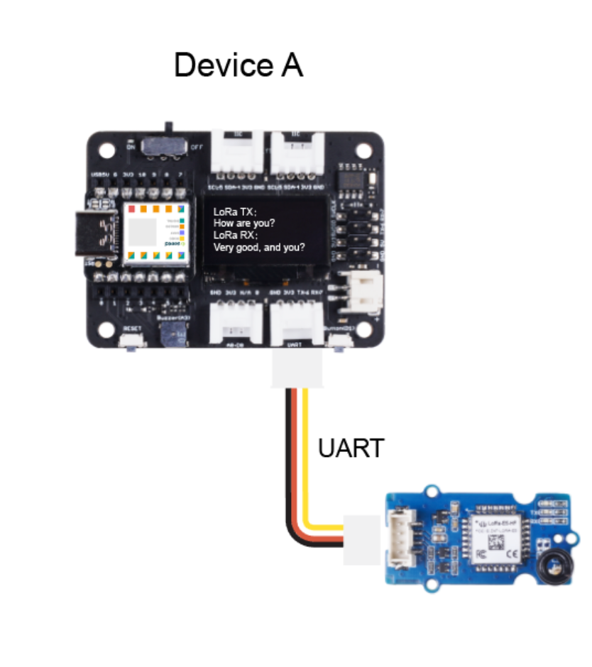
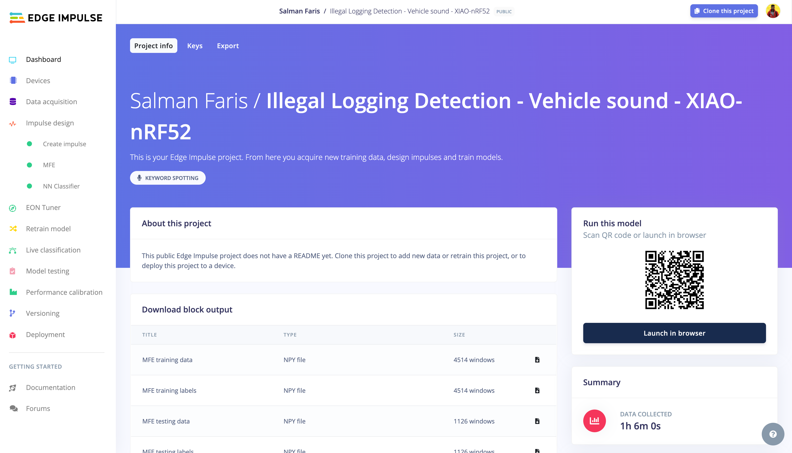
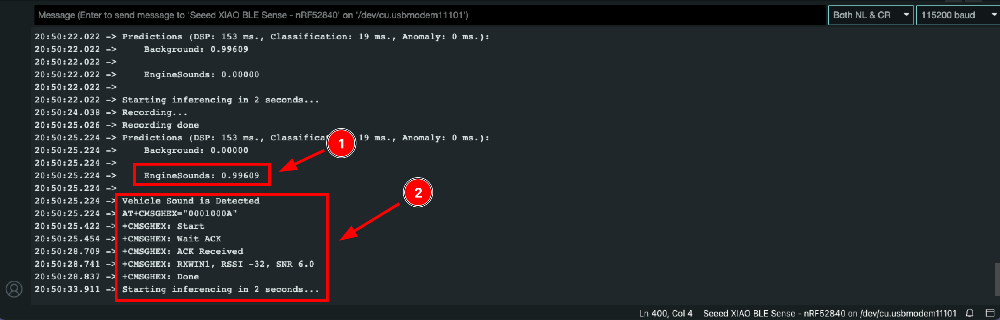
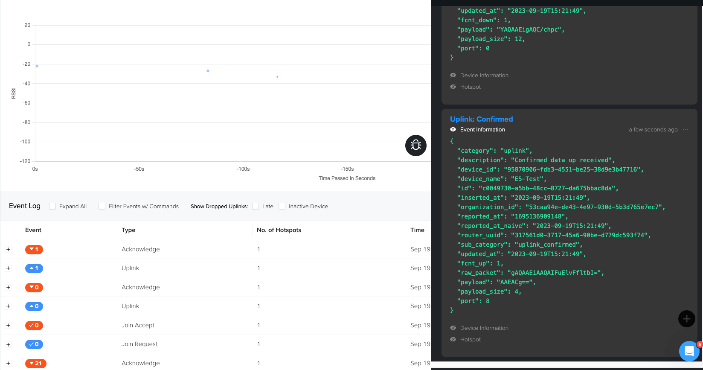

Originally Published at Seeed Wiki  -  [Grove - Wio-E5 Helium and TinyML Application Demo](https://wiki.seeedstudio.com/Grove_Wio_E5_Helium_tinyML_Demo/)



As part of [Seeed Contributor program](https://github.com/Seeed-Studio/wiki-documents/discussions/339) I got opportunity to work with Seeed hardware to build cool projects. As this time, I got [Seeed Grove Wio E5 LoRa module](https://wiki.seeedstudio.com/Grove_LoRa_E5_New_Version/) and [XIAO nRF52840 Sense](https://wiki.seeedstudio.com/XIAO_BLE/) I planned to build an application with it.

Long time ago I had an idea to build a project to help forest ranger to prevent illegal wood logging and poaching and it's an inspiration from google "[The fight against illegal deforestation with TensorFlow](https://blog.google/technology/ai/fight-against-illegal-deforestation-tensorflow/)".

Right now, we have the right tools -> for ML we can now run it on tiny devices Seeed XIAO nRF52840 Sense and We can transmit the message to KM with LoRa technologies. So, that's how I ended up making this project.

## The Algorithm



##

### Hardware Required

* Seeeduino XIAO nRF52840 Sense
* Grove - Wio-E5
* Seeeduino XIAO Expansion Board

### Software Tools/Service Required

* Arduino IDE
* Helium IoT Console.
* USB Type C


## Step 1: Setup XIAO nRF52840 Sense on Arduino IDE
To setup the XIAO, please follow the official guide -[XIAO BLE Getting started](https://wiki.seeedstudio.com/XIAO_BLE/#getting-started).

##

## Step 2: Setup Helium LoRa WAN Console


>  Make sure you are inside the helium network coverage. You can find the network coverage at explorer.helium.com
{: .prompt-info }

> Please ensure the consistent of the frequency band among the end nodes, gateway, and Helium configuration you are using by following this instruction. The frequency plan this demo applied is for IN865.
{: .prompt-info }

The Helium IOT Network uses the LoRaWAN protocol to provide internet connectivity to "Internet of Things" devices and is the original sub network in the Helium ecosystem. Developers and companies around the world rely on the Helium IOT Network for connectivity.

### Step 2.1: Helium IoT Console Preparation

1. Visit [Helium Console](https://console.helium.com/welcome) website and sign up for a new account


2. After logging in, click "Devices" to manage devices.


3. Then click on "Add New Device"


4. Here, 1.Add device a new , 2.Copy the Dev EUI , 3.Copy the App EUI, 4.Copy the App Key, 5.Finally Click Save.


5. Now you can see the device under the "Devices" section.


Now, the helium console setup is done. we can move to the Software part and upload data to the helium console over the helium LoRa network.

##

## Hardware Preparation.

Place the XIAO nRF52840 BLE Sense to the Seeeduino XIAO Expansion board and then Connect the Grove - Wio E5 to the XIAO Expansion board UART Port.



## Software Preparation.

We developed the tinyML model using the Edge impulse tool, and you can find the dataset and project details [here](https://studio.edgeimpulse.com/public/283541/latest), you can also clone the project and do the modifications as per your need.



For now, download the Edge Impulse tinyML library from [here](https://github.com/salmanfarisvp/TinyML/blob/main/XIAO-nRF52840-Sense/src/lib/ei-illegal-logging-detection--vehicle-sound-xiao-nrf52-arduino-1.0.4.zip) and add it the arduino. Follow [this guide](https://wiki.seeedstudio.com/How_to_install_Arduino_Library/#1add-zip-library) to learn how to add ZIP libraries.

After adding the library, copy the code below and past in to your arduino sketch and **replace the helium LoRa WAN Credentials**.

```cpp
/* Edge Impulse ingestion SDK
 * Copyright (c) 2022 EdgeImpulse Inc.
 *
 * Licensed under the Apache License, Version 2.0 (the "License");
 * you may not use this file except in compliance with the License.
 * You may obtain a copy of the License at
 * http://www.apache.org/licenses/LICENSE-2.0
 *
 * Unless required by applicable law or agreed to in writing, software
 * distributed under the License is distributed on an "AS IS" BASIS,
 * WITHOUT WARRANTIES OR CONDITIONS OF ANY KIND, either express or implied.
 * See the License for the specific language governing permissions and
 * limitations under the License.
 *
 * Modified by Salman Faris - Salmanfarisvp.com
 */

// If your target is limited in memory remove this macro to save 10K RAM
#define EIDSP_QUANTIZE_FILTERBANK 0

/*
 ** NOTE: If you run into TFLite arena allocation issue.
 **
 ** This may be due to may dynamic memory fragmentation.
 ** Try defining "-DEI_CLASSIFIER_ALLOCATION_STATIC" in boards.local.txt (create
 ** if it doesn't exist) and copy this file to
 ** `<ARDUINO_CORE_INSTALL_PATH>/arduino/hardware/<mbed_core>/<core_version>/`.
 **
 ** See
 ** (https://support.arduino.cc/hc/en-us/articles/360012076960-Where-are-the-installed-cores-located-)
 ** to find where Arduino installs cores on your machine.
 **
 ** If the problem persists then there's not enough memory for this model and application.
 */


 /*
** Developed by Salman Faris
** Date: 20/09/2023
 */


/* Includes ---------------------------------------------------------------- */
#include <PDM.h>
#include <Illegal_Logging_Detection_-_Vehicle_sound_-_XIAO-nRF52_inferencing.h>
#include <Arduino.h>
#include <U8x8lib.h>

U8X8_SSD1306_128X64_NONAME_HW_I2C u8x8(/*reset=*/U8X8_PIN_NONE);

/** Audio buffers, pointers and selectors */
typedef struct {
  int16_t *buffer;
  uint8_t buf_ready;
  uint32_t buf_count;
  uint32_t n_samples;
} inference_t;

static inference_t inference;
static signed short sampleBuffer[2048];
static bool debug_nn = false;  // Set this to true to see e.g. features generated from the raw signal

//LoRa Buffer
static char recv_buf[512];
static bool is_exist = false;
static bool is_join = false;
static int led = 0;

//Inference Data
int pred_index = 0;    // Initialize pred_index
float pred_value = 0;  // Initialize pred_value

static int at_send_check_response(char *p_ack, int timeout_ms, char *p_cmd, ...) {
  int ch;
  int num = 0;
  int index = 0;
  int startMillis = 0;
  va_list args;
  char cmd_buffer[256];  // Adjust the buffer size as needed
  memset(recv_buf, 0, sizeof(recv_buf));
  va_start(args, p_cmd);
  vsprintf(cmd_buffer, p_cmd, args);  // Format the command string
  Serial1.print(cmd_buffer);
  Serial.print(cmd_buffer);
  va_end(args);
  delay(200);
  startMillis = millis();

  if (p_ack == NULL) {
    return 0;
  }

  do {
    while (Serial1.available() > 0) {
      ch = Serial1.read();
      recv_buf[index++] = ch;
      Serial.print((char)ch);
      delay(2);
    }

    if (strstr(recv_buf, p_ack) != NULL) {
      return 1;
    }

  } while (millis() - startMillis < timeout_ms);
  return 0;
}

static void recv_prase(char *p_msg) {
  if (p_msg == NULL) {
    return;
  }
  char *p_start = NULL;
  int data = 0;
  int rssi = 0;
  int snr = 0;

  p_start = strstr(p_msg, "RX");
  if (p_start && (1 == sscanf(p_start, "RX: \"%d\"\r\n", &data))) {
    Serial.println(data);
    u8x8.setCursor(2, 4);
    u8x8.print("led :");
    led = !!data;
    u8x8.print(led);
    if (led) {
      digitalWrite(LED_BUILTIN, LOW);
    } else {
      digitalWrite(LED_BUILTIN, HIGH);
    }
  }

  p_start = strstr(p_msg, "RSSI");
  if (p_start && (1 == sscanf(p_start, "RSSI %d,", &rssi))) {
    u8x8.setCursor(0, 6);
    u8x8.print("                ");
    u8x8.setCursor(2, 6);
    u8x8.print("rssi:");
    u8x8.print(rssi);
  }
  p_start = strstr(p_msg, "SNR");
  if (p_start && (1 == sscanf(p_start, "SNR %d", &snr))) {
    u8x8.setCursor(0, 7);
    u8x8.print("                ");
    u8x8.setCursor(2, 7);
    u8x8.print("snr :");
    u8x8.print(snr);
  }
}


/**
 * @brief      Arduino setup function
 */
void setup() {
  // put your setup code here, to run once:
  Serial.begin(115200);
  Serial1.begin(9600);
  // comment out the below line to cancel the wait for USB connection (needed for native USB)
  while (!Serial)
    ;
  Serial.println("Edge Impulse Inferencing Demo");

  // summary of inferencing settings (from model_metadata.h)
  ei_printf("Inferencing settings:\n");
  ei_printf("\tInterval: %.2f ms.\n", (float)EI_CLASSIFIER_INTERVAL_MS);
  ei_printf("\tFrame size: %d\n", EI_CLASSIFIER_DSP_INPUT_FRAME_SIZE);
  ei_printf("\tSample length: %d ms.\n", EI_CLASSIFIER_RAW_SAMPLE_COUNT / 16);
  ei_printf("\tNo. of classes: %d\n", sizeof(ei_classifier_inferencing_categories) / sizeof(ei_classifier_inferencing_categories[0]));

  if (microphone_inference_start(EI_CLASSIFIER_RAW_SAMPLE_COUNT) == false) {
    ei_printf("ERR: Could not allocate audio buffer (size %d), this could be due to the window length of your model\r\n", EI_CLASSIFIER_RAW_SAMPLE_COUNT);
    return;
  }


  u8x8.begin();
  u8x8.setFlipMode(1);
  u8x8.setFont(u8x8_font_chroma48medium8_r);

  Serial.begin(115200);
  pinMode(LED_BUILTIN, OUTPUT);
  digitalWrite(LED_BUILTIN, HIGH);

  Serial1.begin(9600);
  Serial.print("E5 LORAWAN TEST\r\n");
  u8x8.setCursor(0, 0);

  if (at_send_check_response("+AT: OK", 100, "AT\r\n")) {
    is_exist = true;
    at_send_check_response("+ID: DevEui", 1000, "AT+ID=DevEui,\"XXXXXXXXXX"\r\n");
    at_send_check_response("+ID: AppEui", 1000, "AT+ID=AppEui,\"XXXXXXXXXXX\"\r\n");
    at_send_check_response("+KEY: APPKEY", 1000, "AT+KEY=APPKEY,\"XXXXXXXXXXXX\"\r\n");
    at_send_check_response("+ID: DevAddr", 1000, "AT+ID=DevAddr\r\n");
    at_send_check_response("+ID: AppEui", 1000, "AT+ID\r\n");
    at_send_check_response("+MODE: LWOTAA", 1000, "AT+MODE=LWOTAA\r\n");
    at_send_check_response("+DR: IN865", 1000, "AT+DR=IN865\r\n");
    at_send_check_response("+CH: NUM", 1000, "AT+CH=NUM,0-2\r\n");
    at_send_check_response("+CLASS: A", 1000, "AT+CLASS=A\r\n");
    at_send_check_response("+PORT: 8", 1000, "AT+PORT=8\r\n");
    delay(200);
    u8x8.setCursor(5, 0);
    u8x8.print("LoRaWAN");
    is_join = true;
  } else {
    is_exist = false;
    Serial.print("No E5 module found.\r\n");
    u8x8.setCursor(0, 1);
    u8x8.print("unfound E5 !");
  }

  //dht.begin();
}

/**
 * @brief      Arduino main function. Runs the inferencing loop.
 */
void loop() {
  ei_printf("Starting inferencing in 2 seconds...\n");

  delay(2000);

  ei_printf("Recording...\n");

  bool m = microphone_inference_record();
  if (!m) {
    ei_printf("ERR: Failed to record audio...\n");
    return;
  }

  ei_printf("Recording done\n");

  signal_t signal;
  signal.total_length = EI_CLASSIFIER_RAW_SAMPLE_COUNT;
  signal.get_data = &microphone_audio_signal_get_data;
  ei_impulse_result_t result = { 0 };

  EI_IMPULSE_ERROR r = run_classifier(&signal, &result, debug_nn);
  if (r != EI_IMPULSE_OK) {
    ei_printf("ERR: Failed to run classifier (%d)\n", r);
    return;
  }


  int pred_index = 0;    // Initialize pred_index
  float pred_value = 0;  // Initialize pred_value

  // print the predictions
  ei_printf("Predictions ");
  ei_printf("(DSP: %d ms., Classification: %d ms., Anomaly: %d ms.)",
            result.timing.dsp, result.timing.classification, result.timing.anomaly);
  ei_printf(": \n");

  for (size_t ix = 0; ix < EI_CLASSIFIER_LABEL_COUNT; ix++) {
    ei_printf("    %s: %.5f\n", result.classification[ix].label, result.classification[ix].value);
    ei_printf("\n");
    if (result.classification[ix].value > pred_value) {
      pred_index = ix;
      pred_value = result.classification[ix].value;
    }
  }


  // Display inference result and Send message to Helium Console.
  if ((pred_index == 1 && (pred_value > 0.8))) {
    ei_printf("Vehicle Sound is Detected ");
    ei_printf("\n");
    int SOS = 10;
    int DeviceID = 1;
    if (is_exist) {
      int ret = 0;
      if (is_join) {

        ret = at_send_check_response("+JOIN: Network joined", 12000, "AT+JOIN\r\n");
        if (ret) {
          is_join = false;
        } else {
          at_send_check_response("+ID: AppEui", 1000, "AT+ID\r\n");
          Serial.print("JOIN failed!\r\n\r\n");
          delay(5000);
        }
      } else {
        char cmd[128];
        sprintf(cmd, "AT+CMSGHEX=\"%04X%04X\"\r\n", (int)DeviceID, (int)SOS);
        ret = at_send_check_response("Done", 5000, cmd);

        u8x8.setCursor(0, 2);
        u8x8.print("      ");
        u8x8.setCursor(2, 2);
        u8x8.print("Vehicle Detected");
        u8x8.setCursor(2, 3);
        u8x8.print("Sending SOS");
        if (ret) {
          recv_prase(recv_buf);
        } else {
          Serial.print("Send failed!\r\n\r\n");
        }
        delay(5000);
      }
    } else {
      delay(1000);
    }

  }
  else {
        u8x8.setCursor(0, 2);
        u8x8.print("      ");
        u8x8.setCursor(2, 2);
        u8x8.print("Normal Condition");
        u8x8.setCursor(2, 3);
        u8x8.print("idle");
  }

#if EI_CLASSIFIER_HAS_ANOMALY == 1
  ei_printf("    anomaly score: %.3f\n", result.anomaly);
#endif
}

/**
 * @brief      PDM buffer full callback
 *             Get data and call audio thread callback
 */
static void pdm_data_ready_inference_callback(void) {
  int bytesAvailable = PDM.available();

  // read into the sample buffer
  int bytesRead = PDM.read((char *)&sampleBuffer[0], bytesAvailable);

  if (inference.buf_ready == 0) {
    for (int i = 0; i < bytesRead >> 1; i++) {
      inference.buffer[inference.buf_count++] = sampleBuffer[i];

      if (inference.buf_count >= inference.n_samples) {
        inference.buf_count = 0;
        inference.buf_ready = 1;
        break;
      }
    }
  }
}

/**
 * @brief      Init inferencing struct and setup/start PDM
 *
 * @param[in]  n_samples  The n samples
 *
 * @return     { description_of_the_return_value }
 */
static bool microphone_inference_start(uint32_t n_samples) {
  inference.buffer = (int16_t *)malloc(n_samples * sizeof(int16_t));

  if (inference.buffer == NULL) {
    return false;
  }

  inference.buf_count = 0;
  inference.n_samples = n_samples;
  inference.buf_ready = 0;

  // configure the data receive callback
  PDM.onReceive(&pdm_data_ready_inference_callback);

  PDM.setBufferSize(4096);

  // initialize PDM with:
  // - one channel (mono mode)
  // - a 16 kHz sample rate
  if (!PDM.begin(1, EI_CLASSIFIER_FREQUENCY)) {
    ei_printf("Failed to start PDM!");
    microphone_inference_end();

    return false;
  }

  // set the gain, defaults to 20
  PDM.setGain(127);

  return true;
}

/**
 * @brief      Wait on new data
 *
 * @return     True when finished
 */
static bool microphone_inference_record(void) {
  inference.buf_ready = 0;
  inference.buf_count = 0;

  while (inference.buf_ready == 0) {
    delay(10);
  }

  return true;
}

/**
 * Get raw audio signal data
 */
static int microphone_audio_signal_get_data(size_t offset, size_t length, float *out_ptr) {
  numpy::int16_to_float(&inference.buffer[offset], out_ptr, length);

  return 0;
}

/**h
 * @brief      Stop PDM and release buffers
 */
static void microphone_inference_end(void) {
  PDM.end();
  free(inference.buffer);
}

#if !defined(EI_CLASSIFIER_SENSOR) || EI_CLASSIFIER_SENSOR != EI_CLASSIFIER_SENSOR_MICROPHONE
#error "Invalid model for current sensor."
#endif
```

Replace the **DevEUI , AppEUI** and **APPKEY** with your credentials obtained from the Helium console. Also make sure to replace the IN865 as per your region FREQ plan.

```cpp
at_send_check_response("+ID: DevEui", 1000, "AT+ID=DevEui,\"xxxxxxxxxxx\"\r\n");
at_send_check_response("+ID: AppEui", 1000, "AT+ID=AppEui,\"xxxxxxxxxxx\"\r\n");
at_send_check_response("+KEY: APPKEY", 1000, "AT+KEY=APPKEY,\"xxxxxxxxxxxxxxx\"\r\n");
at_send_check_response("+ID: DevAddr", 1000, "AT+ID=DevAddr\r\n");
at_send_check_response("+ID: AppEui", 1000, "AT+ID\r\n");
at_send_check_response("+MODE: LWOTAA", 1000, "AT+MODE=LWOTAA\r\n");
at_send_check_response("+DR: IN865", 1000, "AT+DR=IN865\r\n");
at_send_check_response("+CH: NUM", 1000, "AT+CH=NUM,0-2\r\n");
at_send_check_response("+CLASS: A", 1000, "AT+CLASS=A\r\n");
at_send_check_response("+PORT: 8", 1000, "AT+PORT=8\r\n");
```

In the below section, you can see the XIAO will check if there any **Vehicle sound detected** and if it's detected,it will establish an LoRa WAN Connection to the helium console and send data **1** as **Vehicle Sound is Detected** symbol.

```cpp
// Display inference result and Send message to Helium Console.
  if ((pred_index == 1 && (pred_value > 0.8))) {
    ei_printf("Vehicle Sound is Detected ");
    ei_printf("\n");
    int SOS = 10;
    int DeviceID = 1;
    if (is_exist) {
      int ret = 0;
      if (is_join) {

        ret = at_send_check_response("+JOIN: Network joined", 12000, "AT+JOIN\r\n");
        if (ret) {
          is_join = false;
        } else {
          at_send_check_response("+ID: AppEui", 1000, "AT+ID\r\n");
          Serial.print("JOIN failed!\r\n\r\n");
          delay(5000);
        }
      } else {
        char cmd[128];
        sprintf(cmd, "AT+CMSGHEX=\"%04X%04X\"\r\n", (int)DeviceID, (int)SOS);
        ret = at_send_check_response("Done", 5000, cmd);

        u8x8.setCursor(0, 2);
        u8x8.print("      ");
        u8x8.setCursor(2, 2);
        u8x8.print("Vehicle Detected");
        u8x8.setCursor(2, 3);
        u8x8.print("Sending SOS");
        if (ret) {
          recv_prase(recv_buf);
        } else {
          Serial.print("Send failed!\r\n\r\n");
        }
        delay(5000);
      }
    } else {
      delay(1000);
    }

  }
  else {
        u8x8.setCursor(0, 2);
        u8x8.print("      ");
        u8x8.setCursor(2, 2);
        u8x8.print("Normal Condition");
        u8x8.setCursor(2, 3);
        u8x8.print("idle");
  }
```

##

## Demo

> Make sure you are inside the helium network coverage. You can find the network coverage at explorer.helium.com
{: .prompt-info }


After uploading the code, The XIAO nRF52840 Sense will capture sound and check if there is any engine sound using tinyML, so try to play engine sound to trigger the action. Once it's detect the engine sound (1), XIAO will establish the Helium LoRa network connection and send command "1" as **Vehicle Sound is Detected** symbol (2).



You can see the data over the helium console and it's debug window.



##

## ToDo
So far, we made intergration with tinyML and LoRa. and we have few to-dos that you can work as exercise to improve the project.

 - [ ] Intergrate the helium console with dashboard and vishualize the data
 - [ ] Create Email/SMS/Phone Alert with custom dashboard to inform forest ranger.

 ##

 Thank you, please share your feedback in the comment section.


