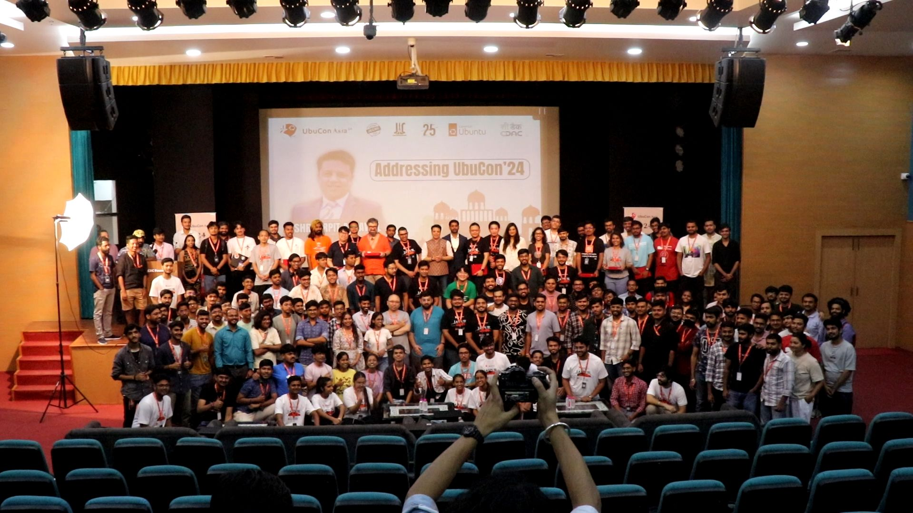
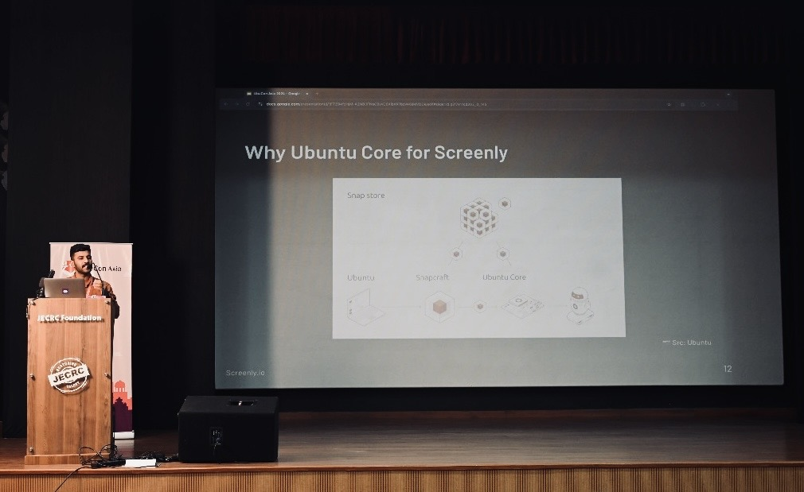
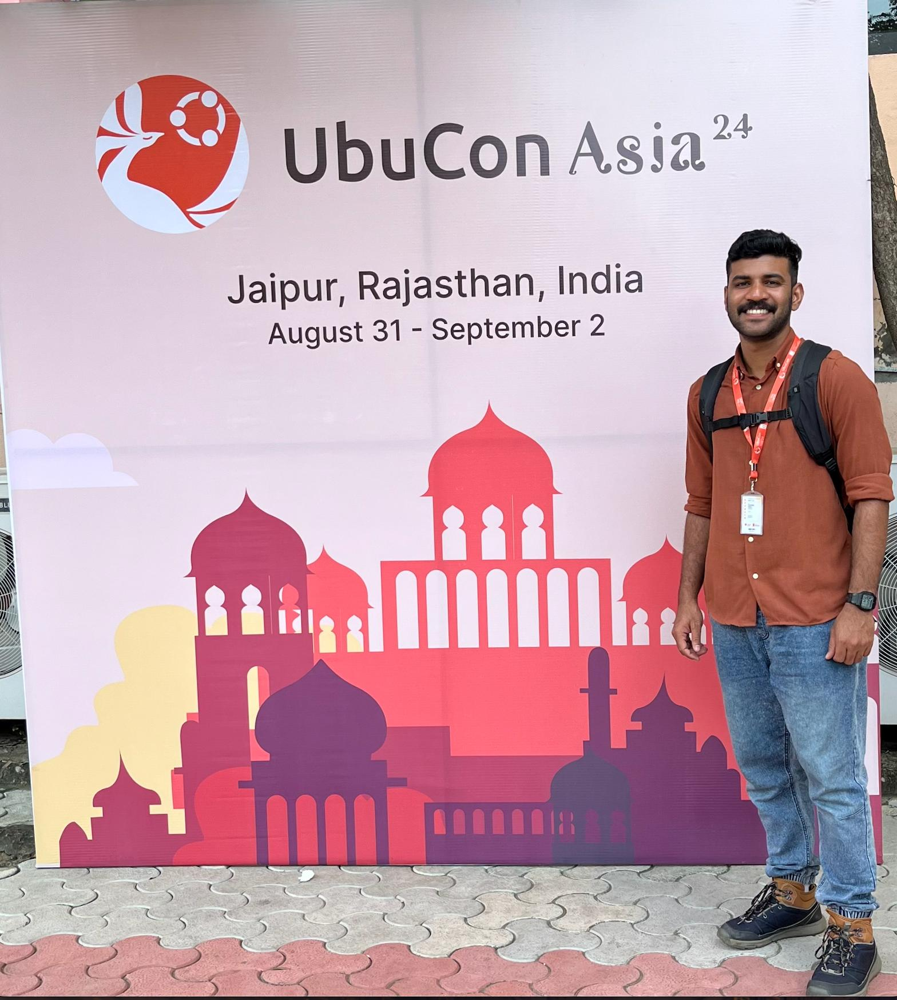

_UbuCon Asia 2024 at Jaipur_

UbuCon Asia 2024 was a memorable event. Thanks to the fantastic organizers Aryan Kaushik, Srijan Srivastava, Youngbin Han, Ravindra PhDhankar Ravindra PhD, host JECRC Incubation Centre, Foundation and notable participants from around Asia and beyond,

Over the past five years, Screenly has worked closely with Canonical to expand its deployment and gained significant Core knowledge. I got to share the Story of Screenly's Journey with Ubuntu Core. 

It was a short talk, but I could cover the positives and negatives, likes and dislikes, and crucial lessons learned from collaborating with Canonical to scaling deployments. 

I also got the opportunity to attend other exciting talks from different domains and attended a few workshops to learn more about the Snaps and Ubuntu core. 

It was great to meet amazing people Bayu Aji, Dimple Kuriakose, Akash Santhosh, Till Kamppeter, Vishal Arya, Navendu Pottekkat, Ananthu C V, Khairul Aizat Kamarudzzaman and more 🎉. 

Finally, thanks to Viktor Petersson and the Screenly team for their continued support
