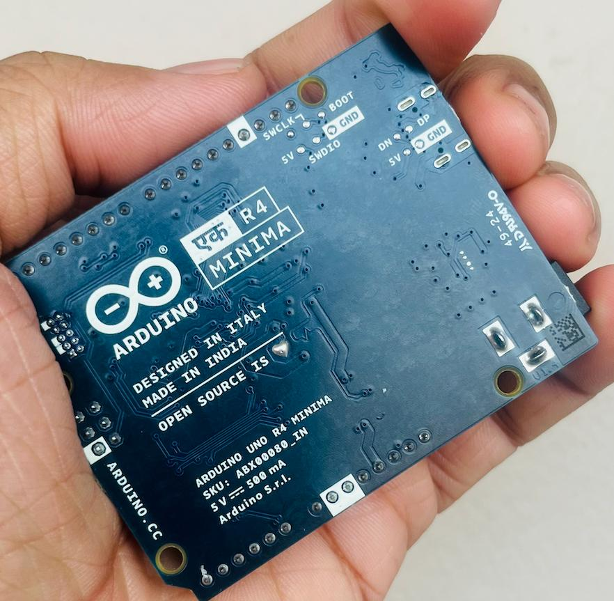

_ആർഡ്വിനോ ഏക് (EK/ एक)_

# എന്താണ് ആർഡ്വിനോ?

ഇലക്ട്രോണിക്സ് പഠിക്കുന്നവർക്കും , ഇലക്ട്രോണിക്സ് അല്ലെങ്കിൽ എംബെഡഡ്ഡിൽ പ്രൊജക്റ്റ് ചെയുന്നവർക് സഹായിക്കുന്ന ഒരു പ്ലാറ്റഫോമാണ് ആര്ടിനോ,  ഇലക്ട്രോണിക്സ് പ്രോട്ടോടൈപിങ് മേഖലയിൽ ഒരു വിപളവം തന്നെയാണ് ആര്ടിനോ കൊണ്ടുവന്നിട്ടുള്ളത്, ആർക്കും ഇലക്ട്രോണിക്സ് അധികം പഠിക്കാതെതാനെ ഇലക്ട്രോണിക്സ് പ്രൊജക്റ്റ് ചെയ്യാൻ ആര്ടിനോ ഉപയോഗിച്ച് പറ്റും. 
ഇറ്റലിയിൽയിലെ IDII-ൽ സ്റ്റുഡൻസിനു ഇലക്ട്രോണിക്സ് പഠിപ്പിക്കാൻ തുടക്കംകുറിച്ച "Wiring" എന്ന പ്രൊജക്റ്റ് അടിസ്ഥാനമാക്കിയാണ് പിന്നിട്  ആര്ടിനോ ഡെവലപ്പ് ചെയിതത് . 

ഇന്ന് ആര്ടിനോ ലോകത്തിൽത്തന്നെ ഇലക്ട്രോണിക്സ് അല്ലെങ്കിൽ എംബെഡഡ് പ്രോട്ടോടൈപിങ്  പ്ലാറ്റഫോമിൽ  മുൻനിരയിൽ നിക്കുന്ന ഒരു  കമ്പനിയാണ്. കേവലം ഒരു ഡെവലൊപ്മെന്റ് പ്ലാറ്റഫോമിന് അപ്പുറം ആര്ടിനോ കമ്പ്യൂട്ടർ കമ്പ്യൂട്ടർ എഡ്യൂക്കേഷനിൽ നല്ല രീതിയിൽ ഇൻഫ്യൂലൻസ് നടത്തിയുണ്ട്.

വേറെയൊരു പ്രേതെകത എന്തന്നാൽ , ആര്ടിണോ ബോർഡ്സ് , സോഫ്ട്‍വെയറെസൊക്കെ ഓപ്പൺസോഴ്സ്‌സാണ്, അര്കവേണമെങ്കിലും ആര്ടിനോ ബോർഡുകൾ നിർമിക്കാം, അതിനുനാവിശ്യമായ diagrames-ഒക്കെ അവർതന്നെ ലഭ്യാമാകിട്ടുണ്ട്. 

# ആര്ടിനോ ഇന്ത്യയിൽ
ഇതൊക്കെ ആണെകിലും ഇന്ത്യയിൽ ഒറിജിനൽ ആര്ടിനോക് ഏകേദശം 3000-രൂപയാണ് വില , അതെ സമയം ക്ലോൺ ആര്ടിണോ 300 -രൂപയ്ക്കു മാർക്കറ്റിൽ കിട്ടാനുമുണ്ട്, അതുകൊണ്ടുതന്നെ നമ്മുടെയിടയിലുള്ള മിക്ക ആര്ടിനോ ബോർഡ്‌സും കോപ്പിയാണ്.  ചെറിയ സ്കൂൾ അല്ലേൽ കോളേജ് പ്രോജെക്ടചെയുമ്പോൾ ഇതുവലിയ പ്രേശ്നമമൊന്നുമല്ല അതെ സമയം അഫൊർഡബിളുംമാണ് , പക്ഷെ കോംപ്ലക്സ് ആയിട്ടുള്ള അല്ലേൽ ശൂക്ഷ്മത ആവശ്യമുള്ള പ്രോഡക്റ്റ് പ്രോട്ടോടൈപ്പിനെ ഇ കോപ്പി/ക്ലോൺ ആര്ടിനോ ഒരു തലവേദനയാണ് - അതുകൊണ്ടുതന്നെ കുറെ ആള്കാര്ക്കാര്ക് ആര്ടിനോ തീരെ താല്പര്യമില്ല . 

ആർട്‌നിയോയുടെ മെയിൻ വരുമാനംമാണ് ഈ ബോർഡ് സെയിൽസ് , അത് ഇ കോപ്പി/ക്ലോൺ ഉണ്ടായൊണ്ട് അതികം ഇന്ത്യയിൽ ലാഭവുമല്ല . പക്ഷെ കണക്കുകൾ നോക്കിയാൽ , ഇന്ത്യയാണ് ആര്ടിനോ സോഫ്ട്‍വെയറുകൾ ഡൗൺലോഡ്ചെയ്യുന്ന രാജ്യങ്ങളിൽ മുന്നിട് നിക്കുന്നുനത് , പക്ഷെ ബോർഡാണെങ്കിൽ സെയിൽസ്മില്ല .

ഇന്ത്യ നല്ല ഒരു മാർക്കറ്റ് ആണെന്ന് ആര്ടിനോയുടെ കണക്കുകൾ നോക്കിയാൽ മനസിലാകും, അതിന്റെ ഭാഗമായി - 2025 ജനുവരി 26-ൽ ആർട്‌നിനോ ഏക് (EK/ एक) റീലീസ്‌ചെയ്തു. ഡെൽഹിയിലാണവർ ഫാക്റ്ററി പ്ലാനുള്ളത്. കഴിഞ്ഞ ആഴ്ച ആര്ടിനോ ഇന്ത്യ ടീമിന്നെ മീറ്റ് ചെയ്യാനുള്ള അവസരവും കിട്ടിയിരുന്നു (Thanks to Deepu S Nath ) അത്പോലെ അവർ നമ്മുടെ കമ്മ്യൂണിറ്റിയ്ക്കുവേണ്ടി പുതുതായി ഇന്ത്യയിൽ നിർമിച്ച ആർട്‌നിനോ ഏക് ടെസ്റ്റ്ചെയാനുംതന്നു. 

ഇന്ത്യയിൽ ഫാക്റ്ററി പപ്ലാന്റ് തുടക്കുന്നതുകൊണ്ട്‌ നമ്മുക് ഒർജിനൽ ആര്ടിനോ 800-രൂപക്ക് കിട്ടും അതുപോലെ കുറെ അധികം ജോലി അവസരവും ഉണ്ടകും . STEM മേഖലക്കും അതു നല്ല ഒരു മത്സരവുമാകും. 

ഞാൻ ഇന്ന് ഇത് എഴുതാനുള്ളകാരണം , ഈ വരുന്ന ഞായറാഴ്ച (16 -03 -2025 ) തിങ്കേർസ്പേസില്  വച്ചൊരു ആര്ടിനോ ഡേ എന്നൊരു പ്രോഗ്രാം TinkerHub and MakerGram നടത്തുന്നുണ്ട് , ലോകത്തിലെ പലഭാഗത്തും നടക്കുന്ന ഈ പ്രോഗ്രാമിൽ നമ്മളും ഭാഗമായുകയാണ്. ആര്ടിനോ അടിത്തനമാക്കിയുള്ള സെഷൻസും ആർട്‌നിനോ ഏക് (EK/ एक)  എക്സ്പീരിയൻസ് ചെയ്‍വാനുള്ള അവസരവുമുണ്ട്. 
പ്രോഗ്രാം പൂർണ്ണമായും സൗജന്യമാണ്/ഫ്രീയാണ് 

originally posted on [facebook](https://www.facebook.com/share/p/1FCCTFsFa5/).  